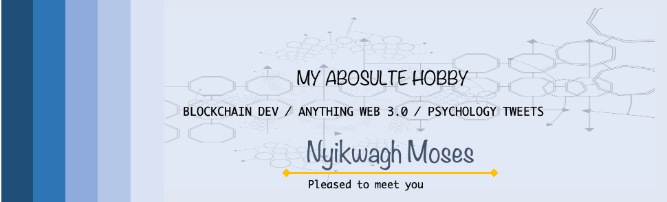

# 💫 About Me:
Hi there! I'm Nyikwagh Moses, a Full-Stack Developer passionate about building scalable and innovative web applications. I specialize in React, Node.js, Web3, and blockchain development, with a deep understanding of smart contracts, payment systems, and decentralized applications (dApps).  💡 What I'm Currently Working On A crypto to fiat payment system that allows users spend crypto as fiat starting with Nigerian Niara A POS system and e-commerce platform that enables store owners to generate their own online store and process payments seamlessly.  Smart contract integration and Ethereum-based transactions to ensure secure and decentralized payments.  Enhancing my knowledge of Web3.js, Ethers.js, and Wagmi to build better blockchain-based solutions.  🤝 What I'm Looking to Collaborate On Full-stack projects involving Web3, React, Node.js, innovative solutions that ease the traditional flow of operations or innovative payment solutions.  Open-source projects that push the boundaries of blockchain integration with traditional web applications.  Building scalable, real-time applications with optimized performance.  🔍 What I'm Looking for Help With Best practices for optimizing blockchain transaction processing.  Advanced backend architectures for handling large-scale dApps.  Exploring AI + Web3 integrations for future-proof applications.  💭 Ask Me About Web3 development, Ethereum, and smart contract interactions.  Frontend frameworks like React, Next.js, and UI libraries (Chakra UI, Material UI).  Payment processing in decentralized systems.  🎯 Fun Fact I enjoy solving coding challenges where successful projects are eligible for payments! I also love diving deep into new technologies and understanding them intuitively before implementation.

## 🌐 Socials:
      

# 💻 Tech Stack:
                                                    
# 📊 GitHub Stats:
 
 

---

<!-- Proudly created with GPRM ( https://gprm.itsvg.in ) -->
